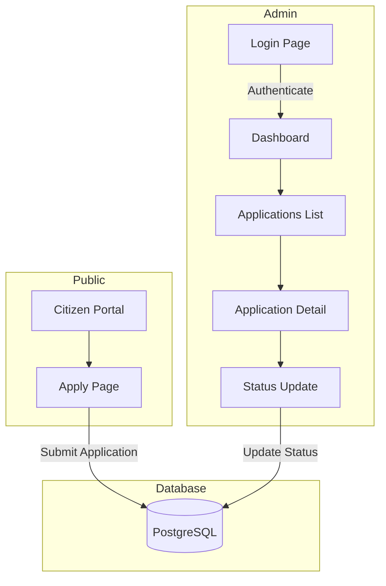
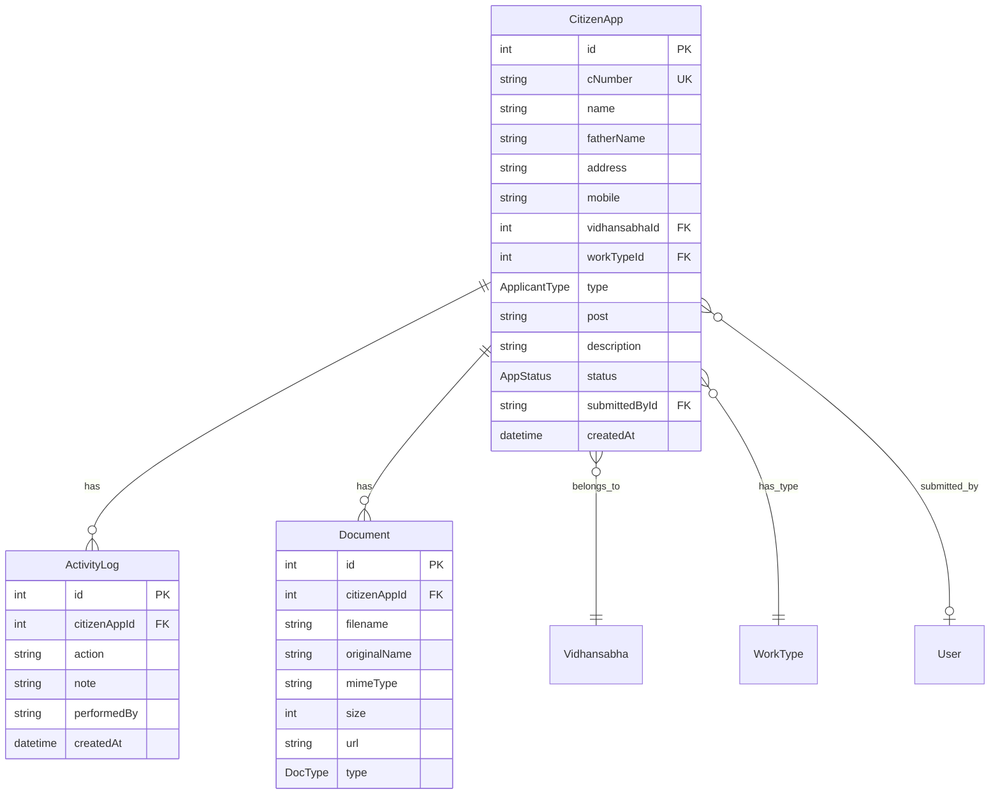
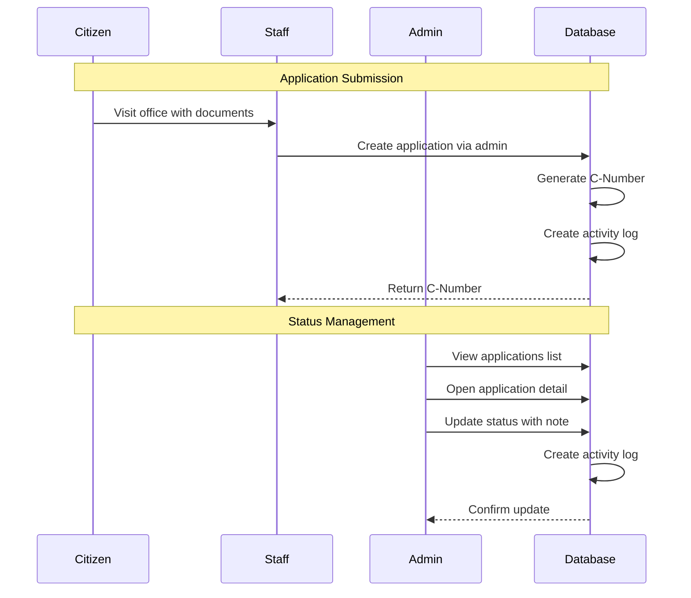

# Admin Dashboard & Application Management Workflow Analysis

## Overview

This document provides a comprehensive analysis of the admin dashboard and citizen application management system for the Dr. Kirodi Lal Meena website.

---

## Architecture Summary

### Workflow Diagram



---

## Component Analysis

### 1. Admin Layout & Authentication

**File:** [`src/app/[locale]/admin/(dashboard)/layout.tsx`](src/app/[locale]/admin/(dashboard)/layout.tsx)

| Aspect | Implementation |
|--------|----------------|
| Auth Check | Server-side session validation via `auth()` |
| Redirect | Unauthenticated users → `/admin/login` |
| Layout | Responsive sidebar + main content area |
| Mobile | Collapsible mobile sidebar with hamburger menu |

**User Roles:**
- `SUPER_ADMIN` - Full access including delete operations
- `ADMIN` - Standard admin operations
- `STAFF` - View and update applications only

### 2. Dashboard Page

**File:** [`src/app/[locale]/admin/(dashboard)/dashboard/page.tsx`](src/app/[locale]/admin/(dashboard)/dashboard/page.tsx)

**Features:**
- Statistics cards with status counts (Total, Pending, In Progress, Resolved)
- Today's applications counter
- Recent applications list (last 5)
- Quick action: New Application button

**Data Fetching:**
```typescript
// Uses Prisma groupBy for efficient counting
const statusCounts = await prisma.citizenApp.groupBy({
    by: ['status'],
    _count: true,
});
```

### 3. Applications List Page

**File:** [`src/app/[locale]/admin/(dashboard)/applications/page.tsx`](src/app/[locale]/admin/(dashboard)/applications/page.tsx)

| Feature | Implementation |
|---------|----------------|
| Pagination | 15 items per page, URL-based page param |
| Filtering | Status filter with counts, Vidhansabha filter |
| Search | Debounced search (750ms) on name, father name, mobile, cNumber |
| Export | Excel export via `/api/export/applications` |
| UI | Card-based grid layout with status accent bars |

**Search Component:** [`ApplicationSearch.tsx`](src/components/admin/ApplicationSearch.tsx)
- Hindi transliteration support via `new-react-transliterate`
- Real-time filtering with debounce
- Status dropdown with count badges

### 4. Application Detail Page

**File:** [`src/app/[locale]/admin/(dashboard)/applications/[id]/page.tsx`](src/app/[locale]/admin/(dashboard)/applications/[id]/page.tsx)

**Sections:**
1. **Header** - Applicant name, C-Number, date, status badge
2. **Applicant Information** - Name, father/husband name, mobile, address
3. **Application Details** - Category, vidhansabha, work type, description
4. **Documents** - Image preview, PDF download links
5. **Status Update Form** - Dropdown + note textarea
6. **Activity Timeline** - Chronological status change history

### 5. Server Actions

**File:** [`src/app/actions/application.ts`](src/app/actions/application.ts)

| Action | Purpose | Auth Required |
|--------|---------|---------------|
| `submitApplication` | Public citizen submission | No |
| `submitApplicationByAdmin` | Admin creates on behalf of citizen | Yes |
| `getApplicationStatus` | Track by C-Number | No |
| `getVidhansabhas` | Fetch dropdown options | No |
| `getWorkTypes` | Fetch dropdown options | No |

**File:** [`src/app/actions/admin.ts`](src/app/actions/admin.ts)

| Action | Purpose | Auth Required |
|--------|---------|---------------|
| `updateApplicationStatus` | Change status + log activity | Yes |
| `deleteApplication` | Remove application | SUPER_ADMIN only |

---

## Database Schema

### Core Tables



### Enums

```typescript
enum AppStatus {
  PENDING      // लंबित
  IN_PROGRESS  // प्रगति में
  RESOLVED     // समाधान
  REJECTED     // अस्वीकृत
}

enum ApplicantType {
  CITIZEN      // नागरिक
  PUBLIC_REP   // जनप्रतिनिधि
}

enum Role {
  SUPER_ADMIN
  ADMIN
  STAFF
}
```

---

## Current Workflow



---

## Strengths

1. **Well-structured codebase** - Clear separation of concerns with server/client components
2. **Bilingual support** - Full Hindi/English localization
3. **Audit trail** - Activity logs track all status changes
4. **Responsive design** - Mobile-first approach with dashboard typography classes
5. **Type safety** - TypeScript with Prisma-generated types
6. **Search optimization** - Debounced search with transliteration for Hindi

---

## Areas for Improvement

### High Priority

| Issue | Current State | Recommendation |
|-------|---------------|----------------|
| No public tracking | Citizens must visit office to check status | Add public tracking page with C-Number lookup |
| Missing validation feedback | Basic error messages | Add field-level validation with Zod schemas |
| No loading states | No skeleton UI | Add loading skeletons for data fetching |
| Limited error handling | Basic try-catch | Implement error boundaries |

### Medium Priority

| Issue | Current State | Recommendation |
|-------|---------------|----------------|
| Basic pagination | Page numbers only | Add page size options, jump to page |
| Single status filter | One status at a time | Multi-select for status filtering |
| No date filtering | Not implemented | Add date range picker |
| No bulk actions | Individual updates only | Add bulk status update, export selected |
| Limited analytics | Basic counts only | Add trend charts, vidhansabha breakdown |

### Low Priority

| Issue | Current State | Recommendation |
|-------|---------------|----------------|
| No notifications | Manual checking | Email/SMS alerts on status change |
| No print view | Screen only | Add printable application summary |
| Limited accessibility | Basic ARIA | Enhanced keyboard navigation, screen reader support |

---

## Recommended Improvements

### 1. Public Application Tracking

Create a public page where citizens can track their application status:

```
/hi/track?cNumber=20260212-ABC123
```

**Benefits:**
- Reduces office visits for status inquiries
- Improves citizen experience
- Decreases staff workload

### 2. Enhanced Dashboard Analytics

Add visual analytics to the dashboard:

- Status trend chart (last 30 days)
- Vidhansabha-wise breakdown
- Work type distribution
- Average resolution time

### 3. Bulk Operations

Enable bulk actions for efficiency:

- Select multiple applications
- Bulk status update
- Bulk export to Excel
- Bulk print summaries

### 4. Advanced Filtering

Improve the search and filter capabilities:

- Date range picker
- Multi-select status filter
- Vidhansabha multi-select
- Save filter presets

### 5. Notification System

Implement notifications:

- Email notification on status change
- SMS integration for critical updates
- In-app notification bell
- Daily digest for admins

---

## Technical Debt

1. **Missing Tests** - No unit or E2E tests
2. **Hardcoded Text** - Some UI text not internationalized
3. **Console Errors** - Error handling uses console.error
4. **Type Any** - Some places use `as any` type assertions

---

## File Reference

| Component | Path |
|-----------|------|
| Dashboard | [`src/app/[locale]/admin/(dashboard)/dashboard/page.tsx`](src/app/[locale]/admin/(dashboard)/dashboard/page.tsx) |
| Applications List | [`src/app/[locale]/admin/(dashboard)/applications/page.tsx`](src/app/[locale]/admin/(dashboard)/applications/page.tsx) |
| Application Detail | [`src/app/[locale]/admin/(dashboard)/applications/[id]/page.tsx`](src/app/[locale]/admin/(dashboard)/applications/[id]/page.tsx) |
| Status Update Form | [`src/components/admin/StatusUpdateForm.tsx`](src/components/admin/StatusUpdateForm.tsx) |
| Search Component | [`src/components/admin/ApplicationSearch.tsx`](src/components/admin/ApplicationSearch.tsx) |
| Application Actions | [`src/app/actions/application.ts`](src/app/actions/application.ts) |
| Admin Actions | [`src/app/actions/admin.ts`](src/app/actions/admin.ts) |
| Database Schema | [`prisma/schema.prisma`](prisma/schema.prisma) |

---

*Analysis completed: February 12, 2026*
