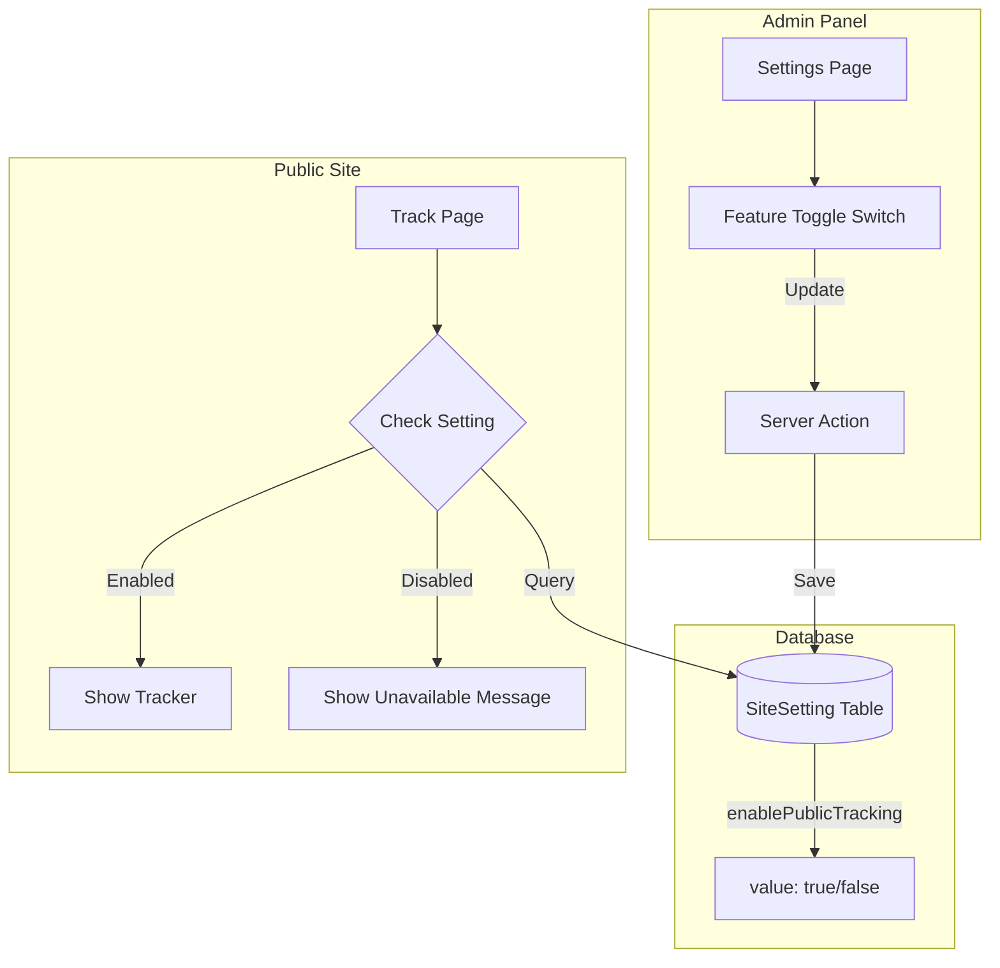

# Feature Toggle Implementation Plan - Public Application Tracking

## Overview

Implement a toggle setting in the admin section to enable or disable the public application tracking page feature. This allows administrators to control whether citizens can publicly track their application status.

---

## Architecture



---

## Implementation Steps

### Step 1: Update Prisma Schema

**File:** `prisma/schema.prisma`

Add `FEATURES` to the `SettingGroup` enum:

```prisma
enum SettingGroup {
  GENERAL
  HERO
  CONTACT
  SOCIAL
  SEO
  FEATURES    // New group for feature toggles
}
```

**Note:** The `SiteSetting` model already supports `BOOLEAN` type, so no schema changes needed for the model itself. We'll use the existing structure:

```prisma
model SiteSetting {
  id        Int      @id @default(autoincrement())
  key       String   @unique
  value     String   @db.Text
  type      SettingType @default(TEXT)
  group     SettingGroup @default(GENERAL)
  createdAt DateTime @default(now()) @map("created_at")
  updatedAt DateTime @updatedAt @map("updated_at")
}
```

**Migration Command:**
```bash
npx prisma migrate dev --name add_features_setting_group
```

---

### Step 2: Add Seed Data for Default Setting

**File:** `prisma/seed.ts`

Add the default setting for public tracking:

```typescript
// Add to seed function
await prisma.siteSetting.upsert({
  where: { key: 'enablePublicTracking' },
  update: {},
  create: {
    key: 'enablePublicTracking',
    value: 'false',
    type: 'BOOLEAN',
    group: 'FEATURES',
  },
});
```

---

### Step 3: Create Server Action for Feature Toggle

**File:** `src/app/actions/admin.ts` (modify existing)

Add a new server action:

```typescript
/**
 * Toggle a feature setting
 */
export async function toggleFeatureSetting(
  key: string,
  enabled: boolean
): Promise<UpdateStatusResult> {
  try {
    const session = await auth();
    
    if (!session?.user || (session.user.role !== 'SUPER_ADMIN' && session.user.role !== 'ADMIN')) {
      return { success: false, error: 'Unauthorized' };
    }

    await prisma.siteSetting.upsert({
      where: { key },
      update: { value: enabled.toString() },
      create: {
        key,
        value: enabled.toString(),
        type: 'BOOLEAN',
        group: 'FEATURES',
      },
    });

    revalidatePath('/admin/settings');
    revalidatePath('/track');
    
    return { success: true };
  } catch (error) {
    console.error('Error toggling feature:', error);
    return { success: false, error: 'Failed to update feature setting' };
  }
}

/**
 * Get feature setting value
 */
export async function getFeatureSetting(key: string): Promise<boolean> {
  try {
    const setting = await prisma.siteSetting.findUnique({
      where: { key },
    });
    return setting?.value === 'true';
  } catch {
    return false;
  }
}
```

---

### Step 4: Create Feature Toggle Component

**File:** `src/components/admin/FeatureToggle.tsx` (new file)

```typescript
'use client';

import { useState, useTransition } from 'react';
import { Switch } from '@/components/ui/switch';
import { Label } from '@/components/ui/label';
import { toast } from 'sonner';
import { toggleFeatureSetting } from '@/app/actions/admin';

interface FeatureToggleProps {
  featureKey: string;
  label: string;
  labelHi: string;
  description: string;
  descriptionHi: string;
  initialValue: boolean;
  locale: string;
}

export default function FeatureToggle({
  featureKey,
  label,
  labelHi,
  description,
  descriptionHi,
  initialValue,
  locale,
}: FeatureToggleProps) {
  const isHindi = locale === 'hi';
  const [enabled, setEnabled] = useState(initialValue);
  const [isPending, startTransition] = useTransition();

  const handleToggle = (checked: boolean) => {
    setEnabled(checked);
    startTransition(async () => {
      const result = await toggleFeatureSetting(featureKey, checked);
      if (result.success) {
        toast.success(
          isHindi 
            ? `सुविधा ${checked ? 'सक्षम' : 'अक्षम'} की गई` 
            : `Feature ${checked ? 'enabled' : 'disabled'}`
        );
      } else {
        setEnabled(!checked); // Revert on error
        toast.error(result.error || (isHindi ? 'त्रुटि हुई' : 'Error occurred'));
      }
    });
  };

  return (
    <div className="flex items-center justify-between p-4 rounded-lg border border-border bg-muted/30">
      <div className="space-y-0.5">
        <Label className="dashboard-section">
          {isHindi ? labelHi : label}
        </Label>
        <p className="dashboard-label text-muted-foreground">
          {isHindi ? descriptionHi : description}
        </p>
      </div>
      <Switch
        checked={enabled}
        onCheckedChange={handleToggle}
        disabled={isPending}
        className="data-[state=checked]:bg-orange-600"
      />
    </div>
  );
}
```

---

### Step 5: Update Settings Page

**File:** `src/app/[locale]/admin/(dashboard)/settings/page.tsx`

Add a new tab for Feature Settings:

```typescript
// Add import
import FeatureToggle from '@/components/admin/FeatureToggle';

// Add to TabsList
<TabsList className="grid w-full grid-cols-2 lg:w-[500px]">
  <TabsTrigger value="account">{isHindi ? 'खाता और सिस्टम' : 'Account & System'}</TabsTrigger>
  <TabsTrigger value="site">{isHindi ? 'वेबसाइट कॉन्फ़िगरेशन' : 'Site Configuration'}</TabsTrigger>
  <TabsTrigger value="features">{isHindi ? 'सुविधाएं' : 'Features'}</TabsTrigger>
</TabsList>

// Add new TabsContent
<TabsContent value="features" className="space-y-6 mt-6">
  <Card className="dashboard-card border-0">
    <CardHeader className="border-b border-border bg-muted/30 pb-4">
      <div className="flex items-center gap-3">
        <div className="w-10 h-10 rounded-xl bg-orange-100 dark:bg-orange-900/30 flex items-center justify-center shadow-sm">
          <ToggleRight className="h-5 w-5 text-orange-600 dark:text-orange-400" />
        </div>
        <div>
          <CardTitle className="dashboard-section">
            {isHindi ? 'सुविधा सेटिंग्स' : 'Feature Settings'}
          </CardTitle>
          <CardDescription className="dashboard-label">
            {isHindi ? 'सार्वजनिक सुविधाएं नियंत्रित करें' : 'Control public-facing features'}
          </CardDescription>
        </div>
      </div>
    </CardHeader>
    <CardContent className="p-6 space-y-4">
      <FeatureToggle
        featureKey="enablePublicTracking"
        label="Public Application Tracking"
        labelHi="सार्वजनिक आवेदन ट्रैकिंग"
        description="Allow citizens to track their application status online"
        descriptionHi="नागरिकों को अपनी आवेदन स्थिति ऑनलाइन ट्रैक करने की अनुमति दें"
        initialValue={formattedSettings['enablePublicTracking'] === 'true'}
        locale={locale}
      />
    </CardContent>
  </Card>
</TabsContent>
```

---

### Step 6: Update Public Tracking Page

**File:** `src/app/[locale]/(public)/track/page.tsx` (new file)

```typescript
import { setRequestLocale } from 'next-intl/server';
import { redirect } from 'next/navigation';
import { Link } from '@/i18n/navigation';
import Header from '@/components/layout/Header';
import Footer from '@/components/layout/Footer';
import prisma from '@/lib/db';
import ApplicationTracker from '@/components/public/ApplicationTracker';
import { Card, CardContent } from '@/components/ui/card';
import { Button } from '@/components/ui/button';
import { Lock, ArrowLeft } from 'lucide-react';

type Props = {
  params: Promise<{ locale: string }>;
  searchParams: Promise<{ cNumber?: string }>;
};

export default async function TrackPage({ params, searchParams }: Props) {
  const { locale } = await params;
  const { cNumber } = await searchParams;
  setRequestLocale(locale);
  const isHindi = locale === 'hi';

  // Check if public tracking is enabled
  const setting = await prisma.siteSetting.findUnique({
    where: { key: 'enablePublicTracking' },
  });

  const isTrackingEnabled = setting?.value === 'true';

  // If disabled, show unavailable message
  if (!isTrackingEnabled) {
    return (
      <div className="min-h-screen flex flex-col">
        <Header />
        <main className="flex-1 flex items-center justify-center p-4">
          <Card className="max-w-md w-full text-center p-8">
            <CardContent className="space-y-6">
              <div className="w-20 h-20 rounded-full bg-muted flex items-center justify-center mx-auto">
                <Lock className="h-10 w-10 text-muted-foreground" />
              </div>
              <div>
                <h1 className="text-2xl font-bold mb-2">
                  {isHindi ? 'यह सुविधा अभी उपलब्ध नहीं है' : 'This feature is currently unavailable'}
                </h1>
                <p className="text-muted-foreground">
                  {isHindi 
                    ? 'आवेदन स्थिति ट्रैक करने की सुविधा अस्थायी रूप से अक्षम है। कृपया बाद में पुनः प्रयास करें या कार्यालय से संपर्क करें।'
                    : 'Application tracking is temporarily disabled. Please try again later or contact our office.'}
                </p>
              </div>
              <Link href="/">
                <Button className="gap-2">
                  <ArrowLeft className="h-4 w-4" />
                  {isHindi ? 'होम पेज पर जाएं' : 'Go to Home Page'}
                </Button>
              </Link>
            </CardContent>
          </Card>
        </main>
        <Footer />
      </div>
    );
  }

  // If enabled, show the tracker
  return (
    <div className="min-h-screen flex flex-col">
      <Header />
      <main className="flex-1">
        {/* Hero Section */}
        <section className="bg-gradient-to-br from-orange-600 via-orange-500 to-yellow-500 text-white py-12 px-4">
          <div className="container mx-auto text-center">
            <h1 className="text-3xl md:text-4xl font-bold mb-4">
              {isHindi ? 'आवेदन स्थिति ट्रैक करें' : 'Track Application Status'}
            </h1>
            <p className="text-lg opacity-90 max-w-2xl mx-auto">
              {isHindi 
                ? 'अपना आवेदन नंबर (C-Number) दर्ज करके अपनी आवेदन की स्थिति देखें'
                : 'Enter your application number (C-Number) to check your application status'}
            </p>
          </div>
        </section>

        {/* Tracker Section */}
        <section className="py-12 px-4 bg-gray-50 dark:bg-gray-900">
          <div className="container mx-auto max-w-2xl">
            <ApplicationTracker locale={locale} initialCNumber={cNumber} />
          </div>
        </section>
      </main>
      <Footer />
    </div>
  );
}
```

---

### Step 7: Add Translations

**File:** `messages/hi.json`

```json
{
  "features": {
    "title": "सुविधा सेटिंग्स",
    "description": "सार्वजनिक सुविधाएं नियंत्रित करें",
    "publicTracking": {
      "label": "सार्वजनिक आवेदन ट्रैकिंग",
      "description": "नागरिकों को अपनी आवेदन स्थिति ऑनलाइन ट्रैक करने की अनुमति दें"
    },
    "enabled": "सक्षम",
    "disabled": "अक्षम"
  },
  "track": {
    "unavailable": {
      "title": "यह सुविधा अभी उपलब्ध नहीं है",
      "description": "आवेदन स्थिति ट्रैक करने की सुविधा अस्थायी रूप से अक्षम है। कृपया बाद में पुनः प्रयास करें या कार्यालय से संपर्क करें।"
    }
  }
}
```

**File:** `messages/en.json`

```json
{
  "features": {
    "title": "Feature Settings",
    "description": "Control public-facing features",
    "publicTracking": {
      "label": "Public Application Tracking",
      "description": "Allow citizens to track their application status online"
    },
    "enabled": "Enabled",
    "disabled": "Disabled"
  },
  "track": {
    "unavailable": {
      "title": "This feature is currently unavailable",
      "description": "Application tracking is temporarily disabled. Please try again later or contact our office."
    }
  }
}
```

---

## Files to Create/Modify

| Action | File | Description |
|--------|------|-------------|
| Modify | `prisma/schema.prisma` | Add FEATURES to SettingGroup enum |
| Modify | `prisma/seed.ts` | Add default setting for enablePublicTracking |
| Modify | `src/app/actions/admin.ts` | Add toggleFeatureSetting and getFeatureSetting actions |
| Create | `src/components/admin/FeatureToggle.tsx` | Reusable toggle component |
| Modify | `src/app/[locale]/admin/(dashboard)/settings/page.tsx` | Add Features tab |
| Create | `src/app/[locale]/(public)/track/page.tsx` | Public tracking page with setting check |
| Create | `src/components/public/ApplicationTracker.tsx` | Client component for tracking |
| Modify | `messages/hi.json` | Add Hindi translations |
| Modify | `messages/en.json` | Add English translations |

---

## Database Changes

### Migration SQL

```sql
-- Add FEATURES to setting_group enum
ALTER TYPE "SettingGroup" ADD VALUE 'FEATURES';

-- Insert default setting
INSERT INTO "site_settings" ("key", "value", "type", "group", "created_at", "updated_at")
VALUES ('enablePublicTracking', 'false', 'BOOLEAN', 'FEATURES', NOW(), NOW())
ON CONFLICT ("key") DO NOTHING;
```

---

## Testing Checklist

- [ ] Migration runs successfully
- [ ] Default setting is seeded correctly
- [ ] Feature toggle appears in admin settings
- [ ] Toggle updates database value
- [ ] Public tracking page shows when enabled
- [ ] Public tracking page shows unavailable message when disabled
- [ ] Setting change takes effect immediately (no restart needed)
- [ ] Hindi/English translations display correctly
- [ ] Only ADMIN and SUPER_ADMIN can toggle features

---

## Security Considerations

| Concern | Mitigation |
|---------|------------|
| Unauthorized access | Server action checks user role |
| Database injection | Prisma parameterized queries |
| CSRF | Next.js built-in CSRF protection |
| Setting manipulation | Only ADMIN+ roles can modify |

---

## Future Enhancements

1. **Audit Log** - Log who changed the setting and when
2. **Scheduled Toggle** - Enable/disable features on schedule
3. **Role-based Features** - Different features for different user roles
4. **Feature Flags Service** - Move to dedicated feature flag service for scaling

---

*Plan created: February 12, 2026*
