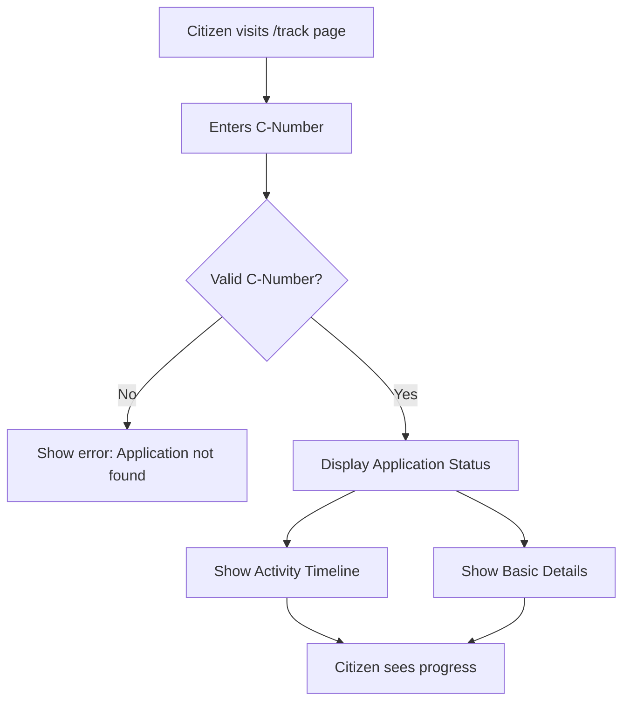

# Public Application Tracking Page - Implementation Plan

## Overview

Create a public-facing page where citizens can track their application status using their unique C-Number (e.g., `20260212-ABC123`).

---

## User Flow



---

## File Structure

```
src/
├── app/
│   └── [locale]/
│       └── (public)/
│           └── track/
│               └── page.tsx              # Main tracking page
├── components/
│   └── public/
│       └── ApplicationTracker.tsx       # Client component for tracking
└── app/
    └── actions/
        └── application.ts               # Existing - add tracking action
```

---

## Implementation Steps

### Step 1: Create Server Action for Public Tracking

**File:** `src/app/actions/application.ts` (modify existing)

Add a new server action that returns limited application data for public viewing:

```typescript
// Public tracking - returns limited data
export async function trackApplication(cNumber: string) {
    try {
        const application = await prisma.citizenApp.findUnique({
            where: { cNumber },
            select: {
                cNumber: true,
                name: true,
                status: true,
                createdAt: true,
                vidhansabha: {
                    select: { nameHi: true, nameEn: true }
                },
                workType: {
                    select: { nameHi: true, nameEn: true }
                },
                activityLogs: {
                    select: {
                        action: true,
                        note: true,
                        createdAt: true,
                    },
                    orderBy: { createdAt: 'desc' },
                },
            },
        });

        if (!application) {
            return { success: false, error: 'Application not found' };
        }

        return { success: true, application };
    } catch (error) {
        return { success: false, error: 'Failed to fetch application' };
    }
}
```

**Security Considerations:**
- Only expose non-sensitive fields (no address, mobile, etc.)
- C-Number is unique and acts as a pseudo-token
- Rate limiting should be considered for production

---

### Step 2: Create Client Component for Tracking

**File:** `src/components/public/ApplicationTracker.tsx`

```typescript
'use client';

import { useState } from 'react';
import { trackApplication } from '@/app/actions/application';
import { Input } from '@/components/ui/input';
import { Button } from '@/components/ui/button';
import { Card, CardContent, CardHeader, CardTitle } from '@/components/ui/card';
import { Badge } from '@/components/ui/badge';
import { Search, Loader2, Clock, MapPin, FileText } from 'lucide-react';

interface ApplicationTrackerProps {
    locale: string;
}

export default function ApplicationTracker({ locale }: ApplicationTrackerProps) {
    const isHindi = locale === 'hi';
    const [cNumber, setCNumber] = useState('');
    const [isLoading, setIsLoading] = useState(false);
    const [result, setResult] = useState<any>(null);
    const [error, setError] = useState('');

    const handleSearch = async () => {
        if (!cNumber.trim()) {
            setError(isHindi ? 'कृपया आवेदन नंबर दर्ज करें' : 'Please enter application number');
            return;
        }

        setIsLoading(true);
        setError('');
        setResult(null);

        const response = await trackApplication(cNumber.trim().toUpperCase());
        
        if (response.success) {
            setResult(response.application);
        } else {
            setError(response.error || (isHindi ? 'आवेदन नहीं मिला' : 'Application not found'));
        }
        
        setIsLoading(false);
    };

    // ... render UI
}
```

**UI Components:**
1. Search input with C-Number placeholder
2. Search button with loading state
3. Error message display
4. Result card with:
   - Status badge (color-coded)
   - Applicant name
   - Vidhansabha
   - Work type
   - Submission date
   - Activity timeline

---

### Step 3: Create Public Tracking Page

**File:** `src/app/[locale]/(public)/track/page.tsx`

```typescript
import { setRequestLocale } from 'next-intl/server';
import { Link } from '@/i18n/navigation';
import Header from '@/components/layout/Header';
import Footer from '@/components/layout/Footer';
import ApplicationTracker from '@/components/public/ApplicationTracker';
import { Card, CardContent } from '@/components/ui/card';
import { Search, HelpCircle, Phone } from 'lucide-react';

type Props = {
    params: Promise<{ locale: string }>;
    searchParams: Promise<{ cNumber?: string }>;
};

export default async function TrackPage({ params, searchParams }: Props) {
    const { locale } = await params;
    const { cNumber } = await searchParams;
    setRequestLocale(locale);
    const isHindi = locale === 'hi';

    return (
        <div className="min-h-screen flex flex-col">
            <Header />
            <main className="flex-1">
                {/* Hero Section */}
                <section className="bg-gradient-to-br from-orange-600 via-orange-500 to-yellow-500 text-white py-12 px-4">
                    <div className="container mx-auto text-center">
                        <h1 className="text-3xl md:text-4xl font-bold mb-4">
                            {isHindi ? 'आवेदन स्थिति ट्रैक करें' : 'Track Application Status'}
                        </h1>
                        <p className="text-lg opacity-90 max-w-2xl mx-auto">
                            {isHindi 
                                ? 'अपना आवेदन नंबर (C-Number) दर्ज करके अपनी आवेदन की स्थिति देखें'
                                : 'Enter your application number (C-Number) to check your application status'}
                        </p>
                    </div>
                </section>

                {/* Tracker Section */}
                <section className="py-12 px-4 bg-gray-50 dark:bg-gray-900">
                    <div className="container mx-auto max-w-2xl">
                        <ApplicationTracker locale={locale} />
                    </div>
                </section>

                {/* Help Section */}
                <section className="py-12 px-4">
                    <div className="container mx-auto max-w-4xl">
                        {/* Help cards */}
                    </div>
                </section>
            </main>
            <Footer />
        </div>
    );
}
```

---

### Step 4: Add Translations

**File:** `messages/hi.json` (add)

```json
{
  "track": {
    "title": "आवेदन स्थिति ट्रैक करें",
    "subtitle": "अपना आवेदन नंबर दर्ज करें",
    "placeholder": "आवेदन नंबर दर्ज करें (जैसे: 20260212-ABC123)",
    "search": "खोजें",
    "notFound": "आवेदन नहीं मिला",
    "status": "स्थिति",
    "submittedOn": "जमा की तारीख",
    "activityTimeline": "गतिविधि समयरेखा",
    "noResults": "कृपया जांचें कि आवेदन नंबर सही है"
  }
}
```

**File:** `messages/en.json` (add)

```json
{
  "track": {
    "title": "Track Application Status",
    "subtitle": "Enter your application number",
    "placeholder": "Enter Application Number (e.g., 20260212-ABC123)",
    "search": "Search",
    "notFound": "Application not found",
    "status": "Status",
    "submittedOn": "Submitted On",
    "activityTimeline": "Activity Timeline",
    "noResults": "Please check if the application number is correct"
  }
}
```

---

### Step 5: Add Navigation Link

**File:** `src/components/layout/Header.tsx` or navigation config

Add a link to the tracking page in the main navigation:

```typescript
{
    href: '/track',
    labelHi: 'आवेदन ट्रैक करें',
    labelEn: 'Track Application'
}
```

---

## Status Badge Component

Create a reusable status badge for public display:

```typescript
// Status colors for public view
const statusConfig = {
    PENDING: {
        color: 'bg-amber-100 text-amber-800 border-amber-200',
        labelHi: 'लंबित',
        labelEn: 'Pending'
    },
    IN_PROGRESS: {
        color: 'bg-purple-100 text-purple-800 border-purple-200',
        labelHi: 'प्रगति में',
        labelEn: 'In Progress'
    },
    RESOLVED: {
        color: 'bg-emerald-100 text-emerald-800 border-emerald-200',
        labelHi: 'समाधान',
        labelEn: 'Resolved'
    },
    REJECTED: {
        color: 'bg-red-100 text-red-800 border-red-200',
        labelHi: 'अस्वीकृत',
        labelEn: 'Rejected'
    }
};
```

---

## Activity Timeline Component

Display the activity log in a timeline format:

```typescript
// Timeline component for public view
function ActivityTimeline({ activities, locale }: { activities: any[], locale: string }) {
    const isHindi = locale === 'hi';
    
    // Map action codes to readable text
    const actionLabels: Record<string, { hi: string, en: string }> = {
        'APPLICATION_SUBMITTED': { hi: 'आवेदन प्राप्त', en: 'Application Received' },
        'STATUS_CHANGED_TO_PENDING': { hi: 'लंबित', en: 'Marked Pending' },
        'STATUS_CHANGED_TO_IN_PROGRESS': { hi: 'प्रगति में', en: 'In Progress' },
        'STATUS_CHANGED_TO_RESOLVED': { hi: 'समाधान हो गया', en: 'Resolved' },
        'STATUS_CHANGED_TO_REJECTED': { hi: 'अस्वीकृत', en: 'Rejected' },
    };

    return (
        <div className="relative pl-6 space-y-4 before:absolute before:inset-0 before:ml-2 before:h-full before:w-0.5 before:bg-border">
            {activities.map((activity, index) => (
                <div key={index} className="relative">
                    <div className="absolute left-0 top-1.5 -ml-[5px] h-3 w-3 rounded-full border-2 border-background bg-primary" />
                    <div className="ml-4">
                        <p className="font-medium">
                            {isHindi ? actionLabels[activity.action]?.hi : actionLabels[activity.action]?.en}
                        </p>
                        <p className="text-sm text-muted-foreground">
                            {new Date(activity.createdAt).toLocaleDateString(isHindi ? 'hi-IN' : 'en-IN', {
                                day: 'numeric',
                                month: 'short',
                                year: 'numeric',
                                hour: '2-digit',
                                minute: '2-digit'
                            })}
                        </p>
                        {activity.note && (
                            <p className="text-sm mt-1 text-muted-foreground">{activity.note}</p>
                        )}
                    </div>
                </div>
            ))}
        </div>
    );
}
```

---

## URL Structure

The tracking page should support URL parameters for direct linking:

```
/hi/track?cNumber=20260212-ABC123
/en/track?cNumber=20260212-ABC123
```

This allows:
1. Direct links in SMS/Email notifications (future)
2. Bookmarking for citizens
3. QR code generation for printed receipts

---

## Security Considerations

| Concern | Mitigation |
|---------|------------|
| Enumeration attacks | C-Number is 13+ chars with random suffix |
| Information disclosure | Only expose non-sensitive fields |
| Rate limiting | Consider adding rate limiting in production |
| Bot scraping | Add CAPTCHA for production if needed |

---

## Testing Checklist

- [ ] Valid C-Number shows correct application
- [ ] Invalid C-Number shows error message
- [ ] Activity timeline displays correctly
- [ ] Status badges are color-coded
- [ ] Hindi/English translations work
- [ ] URL parameter pre-fills search
- [ ] Mobile responsive design
- [ ] Loading states display correctly
- [ ] Error states display correctly

---

## Future Enhancements

1. **SMS/Email Notifications** - Send tracking link when status changes
2. **QR Code** - Generate QR code for printed receipts
3. **Print View** - Printable status report
4. **OTP Verification** - Add mobile OTP for sensitive applications

---

## Estimated Files to Create/Modify

| Action | File |
|--------|------|
| Create | `src/app/[locale]/(public)/track/page.tsx` |
| Create | `src/components/public/ApplicationTracker.tsx` |
| Modify | `src/app/actions/application.ts` |
| Modify | `messages/hi.json` |
| Modify | `messages/en.json` |
| Modify | Navigation config or Header component |

---

*Plan created: February 12, 2026*
